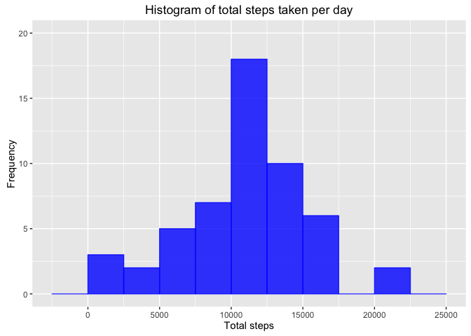

# Reproducible Research: Peer Assessment 1
Meenakshi Parameshwaran  
12 January 2016  

## Introduction 
It is now possible to collect a large amount of data about personal movement using activity monitoring devices such as a Fitbit, Nike Fuelband, or Jawbone Up. These type of devices are part of the “quantified self” movement – a group of enthusiasts who take measurements about themselves regularly to improve their health, to find patterns in their behavior, or because they are tech geeks. But these data remain under-utilized both because the raw data are hard to obtain and there is a lack of statistical methods and software for processing and interpreting the data.

This assignment makes use of data from a personal activity monitoring device. This device collects data at 5 minute intervals through out the day. The data consists of two months of data from an anonymous individual collected during the months of October and November, 2012 and include the number of steps taken in 5 minute intervals each day.

## Loading and preprocessing the data

In this section I will load and preprocess the activity dataset.


```r
# check the working directory has the activity.zip file in it
getwd()
```

```
## [1] "/Users/meenaparam/GitHub/RepData_PeerAssessment1"
```

```r
dir()
```

```
##  [1] "activity.csv"                  "activity.zip"                 
##  [3] "doc"                           "instructions_fig"             
##  [5] "PA1_template_files"            "PA1_template.html"            
##  [7] "PA1_template.md"               "PA1_template.Rmd"             
##  [9] "README.md"                     "RepData_PeerAssessment1.Rproj"
```

```r
# unzip the data to the current directory
unzip(zipfile = "activity.zip", exdir = "./") 

# read in the activity data to a dataframe object called activity
activity <- read.csv(file = "activity.csv", header = T)

# look at the structure of the data
str(activity)
```

```
## 'data.frame':	17568 obs. of  3 variables:
##  $ steps   : int  NA NA NA NA NA NA NA NA NA NA ...
##  $ date    : Factor w/ 61 levels "2012-10-01","2012-10-02",..: 1 1 1 1 1 1 1 1 1 1 ...
##  $ interval: int  0 5 10 15 20 25 30 35 40 45 ...
```

```r
# look at the head and tail of the data
head(activity)
```

```
##   steps       date interval
## 1    NA 2012-10-01        0
## 2    NA 2012-10-01        5
## 3    NA 2012-10-01       10
## 4    NA 2012-10-01       15
## 5    NA 2012-10-01       20
## 6    NA 2012-10-01       25
```

```r
tail(activity)
```

```
##       steps       date interval
## 17563    NA 2012-11-30     2330
## 17564    NA 2012-11-30     2335
## 17565    NA 2012-11-30     2340
## 17566    NA 2012-11-30     2345
## 17567    NA 2012-11-30     2350
## 17568    NA 2012-11-30     2355
```

```r
# convert the date column to a date using the lubridate package
library(lubridate)
activity$date <- ymd(activity$date)

# check the new class
class(activity$date)
```

```
## [1] "POSIXct" "POSIXt"
```

```r
# look at a summary of the data
summary(activity)
```

```
##      steps             date               interval     
##  Min.   :  0.00   Min.   :2012-10-01   Min.   :   0.0  
##  1st Qu.:  0.00   1st Qu.:2012-10-16   1st Qu.: 588.8  
##  Median :  0.00   Median :2012-10-31   Median :1177.5  
##  Mean   : 37.38   Mean   :2012-10-31   Mean   :1177.5  
##  3rd Qu.: 12.00   3rd Qu.:2012-11-15   3rd Qu.:1766.2  
##  Max.   :806.00   Max.   :2012-11-30   Max.   :2355.0  
##  NA's   :2304
```


## What is mean total number of steps taken per day?

In this section, I will ignore NAs.

#### 1. Calculate the total number of steps taken per day.


```r
# load the dplyr package
library(dplyr)

# calculate the total number of steps taken each day, ignoring NAs
totalsteps <- activity %>% 
                filter(!is.na(steps)) %>%
                group_by(date) %>% 
                summarise(totalsteps = sum(steps))

# make sure the date column is in date format
totalsteps$date <- lubridate::ymd(totalsteps$date)
```

**Here is a table showing the total number of steps taken per day, ignoring NAs.**


```r
# use the kable function in the knitr package to draw the table
library(knitr)
kable(totalsteps, format = "html", caption = "Total number of steps taken per day", col.names = c("Date", "Total steps"))
```

<table>
<caption>Total number of steps taken per day</caption>
 <thead>
  <tr>
   <th style="text-align:left;"> Date </th>
   <th style="text-align:right;"> Total steps </th>
  </tr>
 </thead>
<tbody>
  <tr>
   <td style="text-align:left;"> 2012-10-02 </td>
   <td style="text-align:right;"> 126 </td>
  </tr>
  <tr>
   <td style="text-align:left;"> 2012-10-03 </td>
   <td style="text-align:right;"> 11352 </td>
  </tr>
  <tr>
   <td style="text-align:left;"> 2012-10-04 </td>
   <td style="text-align:right;"> 12116 </td>
  </tr>
  <tr>
   <td style="text-align:left;"> 2012-10-05 </td>
   <td style="text-align:right;"> 13294 </td>
  </tr>
  <tr>
   <td style="text-align:left;"> 2012-10-06 </td>
   <td style="text-align:right;"> 15420 </td>
  </tr>
  <tr>
   <td style="text-align:left;"> 2012-10-07 </td>
   <td style="text-align:right;"> 11015 </td>
  </tr>
  <tr>
   <td style="text-align:left;"> 2012-10-09 </td>
   <td style="text-align:right;"> 12811 </td>
  </tr>
  <tr>
   <td style="text-align:left;"> 2012-10-10 </td>
   <td style="text-align:right;"> 9900 </td>
  </tr>
  <tr>
   <td style="text-align:left;"> 2012-10-11 </td>
   <td style="text-align:right;"> 10304 </td>
  </tr>
  <tr>
   <td style="text-align:left;"> 2012-10-12 </td>
   <td style="text-align:right;"> 17382 </td>
  </tr>
  <tr>
   <td style="text-align:left;"> 2012-10-13 </td>
   <td style="text-align:right;"> 12426 </td>
  </tr>
  <tr>
   <td style="text-align:left;"> 2012-10-14 </td>
   <td style="text-align:right;"> 15098 </td>
  </tr>
  <tr>
   <td style="text-align:left;"> 2012-10-15 </td>
   <td style="text-align:right;"> 10139 </td>
  </tr>
  <tr>
   <td style="text-align:left;"> 2012-10-16 </td>
   <td style="text-align:right;"> 15084 </td>
  </tr>
  <tr>
   <td style="text-align:left;"> 2012-10-17 </td>
   <td style="text-align:right;"> 13452 </td>
  </tr>
  <tr>
   <td style="text-align:left;"> 2012-10-18 </td>
   <td style="text-align:right;"> 10056 </td>
  </tr>
  <tr>
   <td style="text-align:left;"> 2012-10-19 </td>
   <td style="text-align:right;"> 11829 </td>
  </tr>
  <tr>
   <td style="text-align:left;"> 2012-10-20 </td>
   <td style="text-align:right;"> 10395 </td>
  </tr>
  <tr>
   <td style="text-align:left;"> 2012-10-21 </td>
   <td style="text-align:right;"> 8821 </td>
  </tr>
  <tr>
   <td style="text-align:left;"> 2012-10-22 </td>
   <td style="text-align:right;"> 13460 </td>
  </tr>
  <tr>
   <td style="text-align:left;"> 2012-10-23 </td>
   <td style="text-align:right;"> 8918 </td>
  </tr>
  <tr>
   <td style="text-align:left;"> 2012-10-24 </td>
   <td style="text-align:right;"> 8355 </td>
  </tr>
  <tr>
   <td style="text-align:left;"> 2012-10-25 </td>
   <td style="text-align:right;"> 2492 </td>
  </tr>
  <tr>
   <td style="text-align:left;"> 2012-10-26 </td>
   <td style="text-align:right;"> 6778 </td>
  </tr>
  <tr>
   <td style="text-align:left;"> 2012-10-27 </td>
   <td style="text-align:right;"> 10119 </td>
  </tr>
  <tr>
   <td style="text-align:left;"> 2012-10-28 </td>
   <td style="text-align:right;"> 11458 </td>
  </tr>
  <tr>
   <td style="text-align:left;"> 2012-10-29 </td>
   <td style="text-align:right;"> 5018 </td>
  </tr>
  <tr>
   <td style="text-align:left;"> 2012-10-30 </td>
   <td style="text-align:right;"> 9819 </td>
  </tr>
  <tr>
   <td style="text-align:left;"> 2012-10-31 </td>
   <td style="text-align:right;"> 15414 </td>
  </tr>
  <tr>
   <td style="text-align:left;"> 2012-11-02 </td>
   <td style="text-align:right;"> 10600 </td>
  </tr>
  <tr>
   <td style="text-align:left;"> 2012-11-03 </td>
   <td style="text-align:right;"> 10571 </td>
  </tr>
  <tr>
   <td style="text-align:left;"> 2012-11-05 </td>
   <td style="text-align:right;"> 10439 </td>
  </tr>
  <tr>
   <td style="text-align:left;"> 2012-11-06 </td>
   <td style="text-align:right;"> 8334 </td>
  </tr>
  <tr>
   <td style="text-align:left;"> 2012-11-07 </td>
   <td style="text-align:right;"> 12883 </td>
  </tr>
  <tr>
   <td style="text-align:left;"> 2012-11-08 </td>
   <td style="text-align:right;"> 3219 </td>
  </tr>
  <tr>
   <td style="text-align:left;"> 2012-11-11 </td>
   <td style="text-align:right;"> 12608 </td>
  </tr>
  <tr>
   <td style="text-align:left;"> 2012-11-12 </td>
   <td style="text-align:right;"> 10765 </td>
  </tr>
  <tr>
   <td style="text-align:left;"> 2012-11-13 </td>
   <td style="text-align:right;"> 7336 </td>
  </tr>
  <tr>
   <td style="text-align:left;"> 2012-11-15 </td>
   <td style="text-align:right;"> 41 </td>
  </tr>
  <tr>
   <td style="text-align:left;"> 2012-11-16 </td>
   <td style="text-align:right;"> 5441 </td>
  </tr>
  <tr>
   <td style="text-align:left;"> 2012-11-17 </td>
   <td style="text-align:right;"> 14339 </td>
  </tr>
  <tr>
   <td style="text-align:left;"> 2012-11-18 </td>
   <td style="text-align:right;"> 15110 </td>
  </tr>
  <tr>
   <td style="text-align:left;"> 2012-11-19 </td>
   <td style="text-align:right;"> 8841 </td>
  </tr>
  <tr>
   <td style="text-align:left;"> 2012-11-20 </td>
   <td style="text-align:right;"> 4472 </td>
  </tr>
  <tr>
   <td style="text-align:left;"> 2012-11-21 </td>
   <td style="text-align:right;"> 12787 </td>
  </tr>
  <tr>
   <td style="text-align:left;"> 2012-11-22 </td>
   <td style="text-align:right;"> 20427 </td>
  </tr>
  <tr>
   <td style="text-align:left;"> 2012-11-23 </td>
   <td style="text-align:right;"> 21194 </td>
  </tr>
  <tr>
   <td style="text-align:left;"> 2012-11-24 </td>
   <td style="text-align:right;"> 14478 </td>
  </tr>
  <tr>
   <td style="text-align:left;"> 2012-11-25 </td>
   <td style="text-align:right;"> 11834 </td>
  </tr>
  <tr>
   <td style="text-align:left;"> 2012-11-26 </td>
   <td style="text-align:right;"> 11162 </td>
  </tr>
  <tr>
   <td style="text-align:left;"> 2012-11-27 </td>
   <td style="text-align:right;"> 13646 </td>
  </tr>
  <tr>
   <td style="text-align:left;"> 2012-11-28 </td>
   <td style="text-align:right;"> 10183 </td>
  </tr>
  <tr>
   <td style="text-align:left;"> 2012-11-29 </td>
   <td style="text-align:right;"> 7047 </td>
  </tr>
</tbody>
</table>

#### 2. Make a histogram of the total number of steps taken each day.

Here is a histogram showing the total number of steps taken each day.


```r
# use the ggplot package to make this histogram
library(ggplot2)

# make the plot
ggplot(data = totalsteps, aes(x = totalsteps)) +
            geom_histogram(col = "blue", fill = "blue", alpha = 0.8, binwidth = 2500) +
            labs(title = "Histogram of total steps taken per day") +
            labs(x = "Total steps", y = "Frequency") +
            scale_y_continuous(breaks = seq(0,20,5), limits = c(0,20))
```

\


#### 3. Calculate and report the mean and median of the total number of steps taken per day.


```r
# remove the NAs to calculate mean and median
mean(totalsteps$totalsteps, na.rm = T)
```

```
## [1] 10766.19
```

```r
median(totalsteps$totalsteps, na.rm = T)
```

```
## [1] 10765
```
The mean number of total steps per day is 10766.  The median number of total steps per day is 10765.

## What is the average daily activity pattern?

#### 1. Make a time series plot (i.e. 𝚝𝚢𝚙𝚎 = "𝚕") of the 5-minute interval (x-axis) and the average number of steps taken, averaged across all days (y-axis)


```r
# calculate the average number of steps taken per interval
library(dplyr)
averagesteps <- activity %>%
                filter(!is.na(steps)) %>%
                group_by(interval) %>% 
                summarise(avgsteps = mean(steps))

# make the plot
library(ggplot2)
ggplot(data = averagesteps, aes(x = interval, y = avgsteps)) +
            geom_line(col = "blue", lwd = 1) +
            labs(title = "Average number of steps taken per 5-minute interval, averaged over all days") +
            labs(x = "5-minute interval", y = "Average number of steps taken")
```

\


#### 2. Which 5-minute interval, on average across all the days in the dataset, contains the maximum number of steps?


```r
# find which 5-minute interval contains the max steps
averagesteps[which.max(averagesteps$avgsteps),]
```

```
## Source: local data frame [1 x 2]
## 
##   interval avgsteps
##      (int)    (dbl)
## 1      835 206.1698
```

The 835<sup>th</sup> minute interval, on average across all the days, contains the maximum number of steps.

## Imputing missing values

#### 1. Calculate and report the total number of missing values in the dataset (i.e. the total number of rows with 𝙽𝙰s)


```r
# calculate the total number of rows with NAs
sum(!complete.cases(activity))
```

```
## [1] 2304
```

There are 2304 rows in the activity dataset with NAs.

#### 2. Devise a strategy for filling in all of the missing values in the dataset. The strategy does not need to be sophisticated. For example, you could use the mean/median for that day, or the mean for that 5-minute interval, etc.

I will use the **mean for that 5-minute interval** as the imputed value for missing values in the dataset.


```r
# see which variables have NAs
summary(activity) # only the steps variable has missings
```

```
##      steps             date               interval     
##  Min.   :  0.00   Min.   :2012-10-01   Min.   :   0.0  
##  1st Qu.:  0.00   1st Qu.:2012-10-16   1st Qu.: 588.8  
##  Median :  0.00   Median :2012-10-31   Median :1177.5  
##  Mean   : 37.38   Mean   :2012-10-31   Mean   :1177.5  
##  3rd Qu.: 12.00   3rd Qu.:2012-11-15   3rd Qu.:1766.2  
##  Max.   :806.00   Max.   :2012-11-30   Max.   :2355.0  
##  NA's   :2304
```

```r
# calculate means per 5-minute interval
library(dplyr)
means5mins <- activity %>%
                filter(!is.na(steps)) %>%
                group_by(interval) %>%
                summarise(mean5mins = mean(steps))
```
#### 3. Create a new dataset that is equal to the original dataset but with the missing data filled in.


```r
# create a new dataset that replaces the missing data with the imputed data

# first join the mean5mins values into the original dataset
activity_imputed <- dplyr::left_join(activity, means5mins, by = "interval")

# identify the rows with NAs in the steps field
na_rows <- is.na(activity_imputed$steps)

# now replace the rows where steps is missing with the mean5mins value
activity_imputed$steps[na_rows] <- activity_imputed$mean5mins[na_rows]

# test the replacement has worked ok
head(activity_imputed)
```

```
##       steps       date interval mean5mins
## 1 1.7169811 2012-10-01        0 1.7169811
## 2 0.3396226 2012-10-01        5 0.3396226
## 3 0.1320755 2012-10-01       10 0.1320755
## 4 0.1509434 2012-10-01       15 0.1509434
## 5 0.0754717 2012-10-01       20 0.0754717
## 6 2.0943396 2012-10-01       25 2.0943396
```

```r
summary(activity_imputed) # no more NAs in the steps column
```

```
##      steps             date               interval        mean5mins      
##  Min.   :  0.00   Min.   :2012-10-01   Min.   :   0.0   Min.   :  0.000  
##  1st Qu.:  0.00   1st Qu.:2012-10-16   1st Qu.: 588.8   1st Qu.:  2.486  
##  Median :  0.00   Median :2012-10-31   Median :1177.5   Median : 34.113  
##  Mean   : 37.38   Mean   :2012-10-31   Mean   :1177.5   Mean   : 37.383  
##  3rd Qu.: 27.00   3rd Qu.:2012-11-15   3rd Qu.:1766.2   3rd Qu.: 52.835  
##  Max.   :806.00   Max.   :2012-11-30   Max.   :2355.0   Max.   :206.170
```

```r
# now remove the mean5mins column from the imputed dataset
activity_imputed$mean5mins <- NULL
```

#### 4a. Make a histogram of the total number of steps taken each day.

Here is the histogram of the total number of step taken each day, using the imputed dataset.


```r
# calculate the total number of steps taken each day in the imputed dataset
totalsteps_imp <- activity_imputed %>% 
                group_by(date) %>% 
                summarise(totalsteps = sum(steps))

# make the plot
library(ggplot2)
ggplot(data = totalsteps_imp, aes(x = totalsteps)) +
            geom_histogram(col = "blue", fill = "blue", alpha = 0.8, binwidth = 2500) +
            labs(title = "Histogram of total steps taken per day") +
            labs(x = "Total steps", y = "Frequency") +
            scale_y_continuous(breaks = seq(0,30,5), limits = c(0,30))
```

\


```r
# remove the NAs to calculate mean and median
mean(totalsteps_imp$totalsteps, na.rm = T)
```

```
## [1] 10766.19
```

```r
median(totalsteps_imp$totalsteps, na.rm = T)
```

```
## [1] 10766.19
```

#### 4b. Calculate and report the mean and median total number of steps taken per day. Do these values differ from the estimates from the first part of the assignment? What is the impact of imputing missing data on the estimates of the total daily number of steps?

The mean number of total steps per day after imputing missing values is still 10766.  The median number of total steps per day is the same as the mean: 10766. These values do not really different from the estimates at the first part of the assignment. Imputing missing data, using the mean value of steps per interval, has not had much impact on the estimates of the total daily number of steps.

## Are there differences in activity patterns between weekdays and weekends?

#### 1. Create a new factor variable in the dataset with two levels – “weekday” and “weekend” indicating whether a given date is a weekday or weekend day.


```r
# use lubridate to assign a number to each day - 1 and 7 are Sunday and Saturday
activity_imputed$day <- lubridate::wday(activity_imputed$date)
activity_imputed$day[activity_imputed$day == 1 | activity_imputed$day == 7] <- "Weekend"
activity_imputed$day[activity_imputed$day > 1 & activity_imputed$day < 7] <- "Weekday"

# convert the day variable to a factor
activity_imputed$day <- as.factor(activity_imputed$day)

# check the distribution of the day variable
table(activity_imputed$day)
```

```
## 
## Weekday Weekend 
##   12960    4608
```

#### 2. Make a panel plot containing a time series plot (i.e. 𝚝𝚢𝚙𝚎 = "𝚕") of the 5-minute interval (x-axis) and the average number of steps taken, averaged across all weekday days or weekend days (y-axis).

The time-series plot shows that, on average, fewer steps are taken throughout the day on weekends compared to weekdays.


```r
# use dplyr to get the averages
averagesteps_days <- activity_imputed %>%
                                group_by(day, interval) %>%
                                summarise(avgsteps = mean(steps))

# make the plot, facetted by day 
library(ggplot2)
ggplot(data = averagesteps_days, aes(x = interval, y = avgsteps)) +
            geom_line(col = "blue", lwd = 1) +
            labs(title = "Average number of steps taken per 5-minute interval, split between weekdays and weekends") +
            labs(x = "5-minute interval", y = "Average number of steps taken") +
            facet_grid(day ~ .)
```

\
